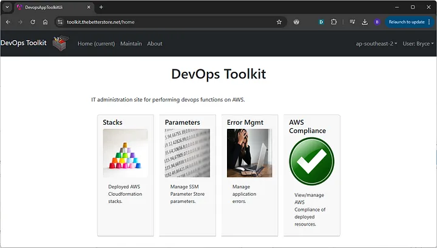
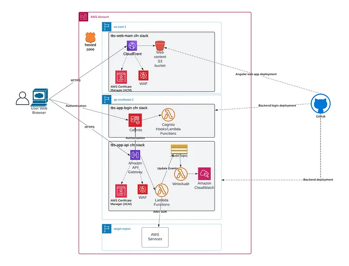
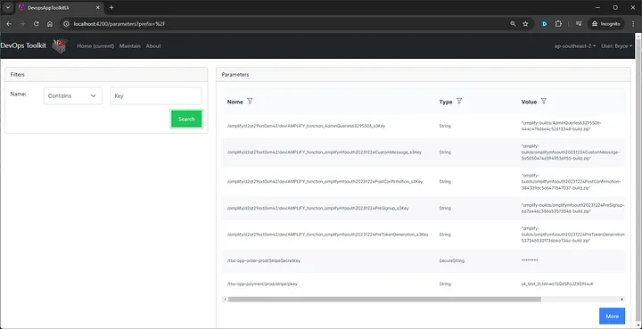
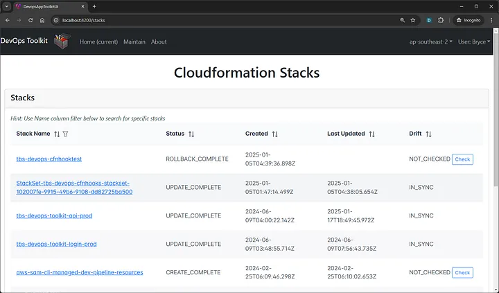
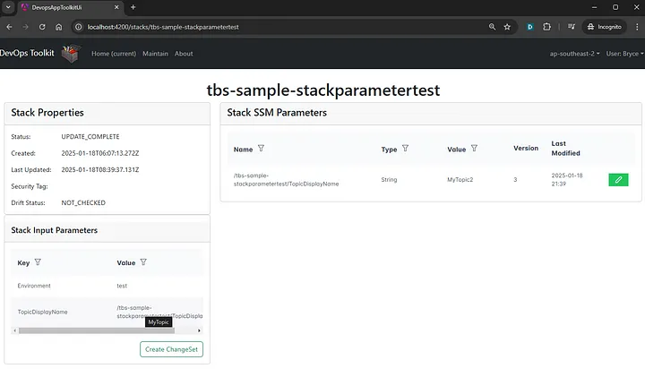
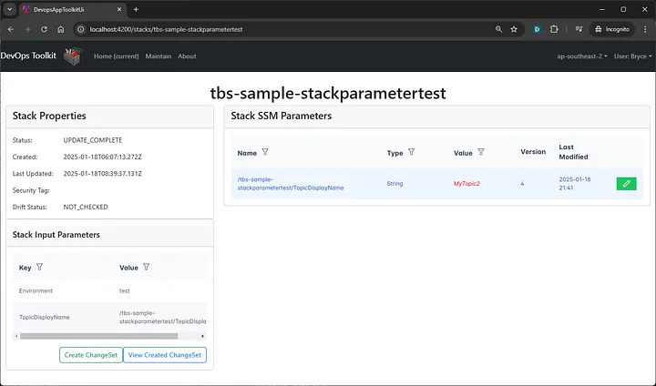
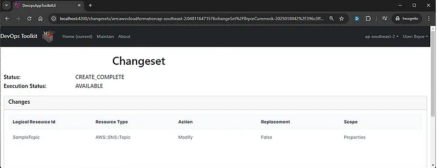
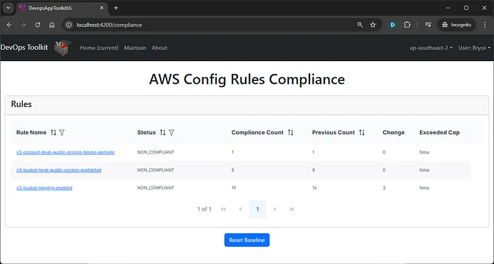
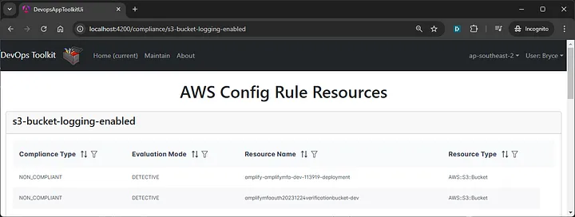

# AWS DevOps Toolkit — an open-source full-stack web application for managing Cloudformation stacks and AWS Config compliance

## Overview

Configuration and compliance management and support of multiple applications deployed across Cloud environments within an organisation can be an arduous task for those involved; including developers, DevOps and SRE teams. In a quest for simplifying the operations involved for AWS Cloudformation-based applications, and with reference to my existing open-source The Better Store eCommerce solution, I introduce here AWS DevOps Toolkit; also an open-source application which currently performs the following functions:

Configuration management of AWS SSM Parameter Store variables, which is typically used for providing configuration values for AWS applications at both deployment and runtime.
Configuration management/updates of AWS Cloudformation Stacks which take SSM Parameter Store variables as input parameters.
Cloudformation stack drift detection and visualisation.
AWS Config compliance checks visualisation and tracking.
Error management for typical application error handling is coming soon; for example, for managing and replaying of failed asynchronous requests that arrive on dead-letter queues.

While the primary aim of AWS DevOps Toolkit is to provide secure and user-friendly functionality to assist AWS Cloud engineers for managing applications, it is also built to showcase how a secure full-stack web application may be built with AWS services that integrate with its backend, to highlight other AWS features which are specific to operational management of environments (e.g. AWS Config, Security Hub), and how Cloud-native and AWS-specific error handling methods and patterns may be employed.



## High Level Design

AWS Toolkit consists of 3 separate Cloudformation stacks, being:

1. tbs-app-login: Implements a Cognito UserPool and helper lambda functions to provide user signup, authentication/login and authorisation facilities, as used by both frontend (tbs-web-main) and backend (tbs-app-api) stacks.
2. tbs-web-main: Implements the frontend as an Angular Single Page Application (SPA) website, using AWS Cloudfront and AWS S3 for static hosting, alongside AWS Amplify libraries to provide signup and signin functionality, integrating with tbs-app-login.
3. tbs-app-api stack: Implements RESTful API services using NodeJS and typescript, to provide secure backend functionality for invocation from the website.



### Security Concerns

AWS DevOps Toolkit is made available on the Internet, to allow authorised users to provide support functions to AWS services hosted on its implemented account. As such, high security protection is vital for the application’s implementation at all layers. Such protections include:

1. Sign-up of trusted users
The AWS DevOps Toolkit UI provides sign-up functionality for users belonging to its owning organisation; allowing only emails addresses from the organisation’s domain, which must then be verified.
On successful verification of a user’s organisation email, they are required to provide a password of at-least 14 characters, and register multifactor authentication (MFA) for future logins.
Email whitelisting functionality is provided by Cognito lambda hooks during the signup process.
Following signup, a user needs to request a system administrator to assign them to a Cognito group of User, Maintainer or Administrator to use its functionality.

2. Signin of users
As above, user authentication requires MFA to complete, using facilities provided by AWS Cognito. On completion, AWS Cognito uses oAuth to authenticate users, and returns a JWT token containing the user’s details and assigned groups (‘claims’) to the frontend upon successful login. 
The included claims provides Role-Based Access Control (RBAC) of users, which the frontend uses to determine which functionality is presented to users based on their allocated role(s). The JWT token is securely-stored and tamper-proof in the user’s browser session, and is also passed to API requests where they are also validated by API Gateway against Cognito for backend authentication. Backend authorisation is provided by interrogation of the presented claims in the Jwt token (after its interrogation).

3. Transport-based encryption is provided using AWS Certificate Manager for all traffic to the website, API backend, and Cognito. At-rest encryption is provided using KMS-based encryption of all AWS data-storing resources. No sensitive information is stored by its implemented resources, with the exception of AWS Cognito for the management of user logins.
4. Protection against OWASP Top10 and other exploits may be provided against the frontend and backend services using AWS WAF, and other protection methods are also in-place as recommended for web application development; e.g. via implementation of Content Security Policies and other HTTP security header controls. Web scanner tools such as Mozilla Observatory may be used for checking for such vulnerabilities.
5. Implementation of the least-privilege principle is also employed at all layers of the application. Backend lambda functions which may perform queries against a target AWS Account’s resources use role-based permissions for only the features that they require.
6. Audit controls also record all user activity.

### Solution Prerequisites

The following are required for implementing the solution to an AWS account from a development PC or build pipeline:

1. Both AWS CLI and AWS SAM CLI utilities are installed.
2. NodeJS v18+ (the example will be implemented in Typescript, to target the NodeJS 18.x runtime)
3. A deployment bucket is created within the target AWS account, as used by SAM to store built lambda artefacts and Cloudformation templates prior to their deployment.
4. A deployment user with least-privileges is configured for the target account, to allow deployment of the in-scope AWS resources.
A user access key is also securely created and used for this to perform deployments, and an AWS user profile ‘thebetterstore’ is configured to use these. NB it is expected a productionized process would perform deployments within a DevOps pipeline, and that IAM roles may instead be used, which are preferred over user access keys.
5. An S3 bucket for deployment, Route53 domain name for hosting, AWS Config enabled in the accounts/regions where these wish to be monitored by Toolkit.
6. Assuming a development PC is running Linux, deployment of the solution involves:

    i. Configuring and running bin/deploy-login.sh

    ii. Configuring and running bin/deploy-api.sh

    iii. Updating the following files in devops-toolkit-web, using Cognito configurations produced from deploy-login deployment in

    — /environments/environment.ts

    — amplifyconfiguration.json

    — aws-exports.js

    iv. Configuring and running bin/deploy-web.sh

    v. Configuring and running bin/deploy-webcontent.sh (to upload the built Angular project to the web hosting bucket.

## Implementation

The current version of DevOps Toolkit implements the following features to authenticated users for administering an AWS account:

#### 1. SSM Parameter Stores Maintenance
   SSM parameter values can currently be viewed one at a time using the AWS web console. In order to obtain better visibility, functionality has been added to AWS Devops Toolkit which allows SSM parameter store variables to be queried and values displayed in list format, with filtering capabilities included. For example, the functionality enables specific key words such as property name substrings to be found in what could be 100’s of variables, from where they can be edited, as illustrated below:



#### 2. Cloudformation Stacks List and Drift
A list of Cloudformation stacks that have been deployed to a region (as selectable from the top-bar menu) can be viewed by Stacks maintenance screen, as below:



This functionality is similar to the AWS Cloudformation web console, but also allows drift detection of multiple stacks to be viewed at a glance, which can be valuable for checking whether there is a risk of manual updates applied since the last update being lost when a subsequent update is planned.

#### 3. Cloudformation Stack Configuration, using SSM Parameter Store
Selecting a stack from the list above allows further information including its input parameters to be viewed, for example:



A convention that is followed for TheBetterStore Cloudformation stacks, is that potentially volatile variables that are configured for a stack are specified using SSM Parameter Store variables with /<stackname>/ as their prefix, as is the case for TopicDisplayName above. Its sample template is defined as follows:

```
AWSTemplateFormatVersion: '2010-09-09'
Description: Parameter sample
Parameters:
  Environment:
    Type: String

  TopicDisplayName:
    Type: AWS::SSM::Parameter::Value<String>
    Default: /tbs-sample-stackparametertest/TopicDisplayName
        
Resources:
  SampleTopic:
    Type: AWS::SNS::Topic
    Properties:
      DisplayName:
        Fn::Sub: ${TopicDisplayName}
```

When viewing a stack, DevOps Toolkit displays a list of the template’s parameters on the left-side of the screen, and a list of SSN Parameters which follow the naming convention on the right. It then provides facilities to update the stack with a new parameter value, by providing editing features for the parameters, and creation and execution of a cloudformation stack update for this to be picked-up. This methodology provides the following advantages:

1. Changes can be applied to resources within the stack without causing stack drift or requiring source code changes.
2. Changes to parameters will not be lost with subsequent Cloudformation stack updates from a Version Control System or deployment pipeline; SSM parameter store values are the golden source of information.
3. SSM parameter store provides an audit history of value changes.

The following screens show resulting steps of updating a stack’s SSM parameter store values:



Clicking “View Created Changeset” first shows scope of what resources will change within the stack. Clicking Execute finally results in the update being applied:



#### 4. AWS Config Compliance

AWS Config is a regional feature which may be enabled in AWS accounts to track configuration changes of AWS resources, and measure these against defined rules which correlate to AWS and industry standards and best practices with regards to security and reliability. For example, security rules may include checking that EC2 instances are not deployed with public IP address, and that RDS databases have their storage encrypted with KMS keys. Reliability rules may include checks that RDS databases have multi-AZ configured (noting this has cost implications), and backups enabled.

The AWS web console provides reporting tools for AWS Config compliance. AWS Devops Toolkit does however try to make this more visible to its users including developers to promote awareness of the rules, and it currently provides basic tracking facilities to see how non-compliance numbers may change over time. A screenshot (of a new, almost-empty account with few AWS Config rules) is shown below:



Clicking on any rule results in the non-compliant items being displayed:



Future plans are under consideration to allow specific resources to be marked as exempt from reporting, and entry of notes/reasons for this to help improve compliance management, and for focus to be on those that require more immediate attention.

#### 5. Error Handling

Functionality to assist IT support staff is being considered for future implementation.
